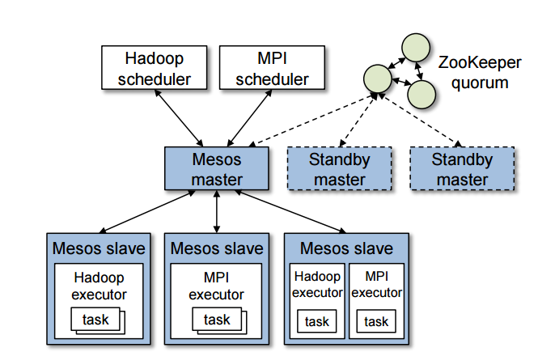
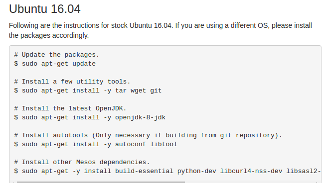
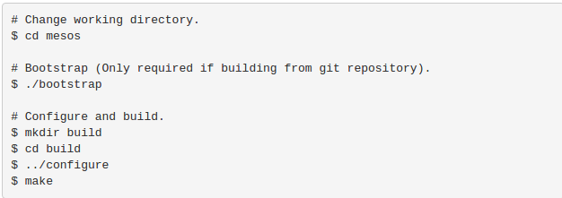

### 1.阅读Mesos论文《Mesos: A Platform for Fine-Grained Resource Sharing in the Data Center》，并了解数据中心操作系统的概念

+ 提出Mesos论文中的内容
Mesos是支持在多种计算集群框架（frameworks）间共享服务器集群的平台，利用HADOOP，MPI。提高了集群资源占用率，避免了每 种框架的数据重复。Mesos能够镜像细粒度的资源共享，通过轮流的读取磁盘数据是的frameworks能从本地获取数据。为了满足复杂的资源调度方 法，Mesos引入了称为资源提供的（resource offer）的2层资源调度机制。Mesos决定多少资源分配给frameworks，frameworks决定接受多少资源和决定哪个任务使用多少资源。
Mesos，一个薄的资源共享层，通过对集群框架提供共有的访问集群资源的接口，使得在多样化的集群计算框架中实现细粒度共享成为可能
数据中心操作系统主要做到了将数据中心的大规模服务器集群视为了一个计算机，对其中的CPU、内存、储存装置以及其他运算资源，全部加以虚拟化，并进行管理。同时，如Spark这类并行计算框架或Hadoop这类分布存储框架等应用都可以运行于其上。

Mesos包括一个master进程，它管理着在每个集群节点上运行的slave进程。而集群框架在这些slave节点上运行任务。
每一种运行在Mesos的集群框架包含两部分：一个注册到master进程中的调度器（scheduler），用于提供资源；以及一个运行在slave节点上的执行（executor）进程，用于运行集群框架的任务。master进程决定给每个进程提供多少资源，集群框架的调度器选择使用哪一种被调度的资源。当一个集群框架接受了被提供的资源，集群框架会给Mesos传递一个它想要运行在这些资源之上的任务的描述。
Mesos赋予了集群框架拒绝被提供的资源的能力。一个集群框架为了等待满足它约束的资源会拒绝不满足它约束的资源。因此，这个拒绝机制使得集群框架能够支持任意复杂的资源约束，同时能够保证Mesos的简单和可扩展。Mesos也允许集群框架设置filters对资源提供模型进行性能优化。

### 2.了解虚拟机和容器技术，用自己的话简单叙述、总结并对比

####+ 虚拟机技术
虚拟机是用软件模拟一台真实计算机设备的技术。它通过软件模拟出的隔离环境中的计算机系统具有完整的硬件功能。它是一种操作系统级别的虚拟化技术。提供的是一个非常完整的虚拟化硬件层
####+ 容器技术
容器是在计算机的操作系统内核之上隔离出了若干虚拟的专有空间，这些容器系统共享主机系统的内核。它也是一种虚拟化技术，但抽象程度稍低一些
####+ 两者的对比
虚拟机是通过操作系统隔离的，开销较大，是重量级的，分钟级启动的；而容器是通过进程技术隔离的，开销较小，是轻量级的。而比容器虚拟机相对于容器更加安全，因为虚拟机提供了专用的操作系统和更牢固的逻辑边界。而彼此相邻的容器共享处理器。两种技术在使用场景上的差距也是非常大的， 虚拟机的花我们平常用在从原有的系统中分离去一定的计算机硬件资源去运行另一个系统级的应用。而容器的花很多容器相当于在系统上运行的一个程序没，而这个程序帮我们管理我们的其他程序。所以说容器和虚拟机仅仅相似于它们都提供了隔离环境。容器比起虚拟机能做的事少得多并且使用起来相当廉价。而虚拟机提供整个虚拟化硬件层，可以做更多的事情但是使用成本显著。

### 从github上获取mesos项目，切换到tag为1.1.0的版本自己build并运行起来

+ 通过下面的方法去biuld并运行起来了

### 运行Spark on Mesos(说明)，以不同并行度运行两次wordcount程序并比较，需要在报告中详细说明并附资源使用情况及时间花费截图

+ 根据Running Spark on Mesos的步骤进行设置。下载Spark之后，需要对conf/spark-env.sh和conf/spark-default.conf做一些修改。

### 叙述自己对这些软件技术与具体安装运行过程的看法，对于觉得存在问题的地方可以自己查阅资料或咨询助教
+ 软件的安装过程和具体的运行过程比较繁琐， 并且很容易出错。 Mesos的安装和运行过程占了不少时间。
