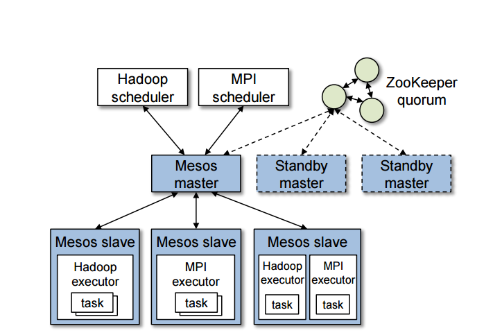
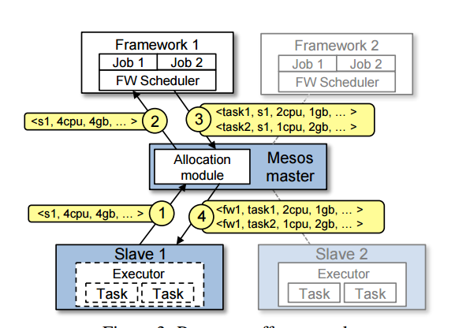
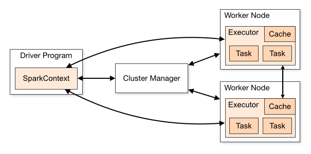

# 作业报告
### 1.用自己的语言描述Mesos的组成结构，指出它们在源码中的具体位置，简单描述一下它们的工作流程

#### mesos的组织结构
Mesos的论文里上述图片包含了mesos的所有的组织结构。Mesos master 是接受Mesos slave和Framework scheduler的注册并且分配资源。这种机制使得细粒度的资源共享称为了可能。master会根据现有的分配组织策略来决定对各个框架分别offer多少资源。为了支持多种分配策略，master通过模块化架构和模块插入机制使其较为简单地实现。 Zookeeper是选出Mesos master。 standby master是作为备用master，和master节点在一个集群中运行。像hadoop Spark等Framework包括两个部分，分别时Executor和SchedulerScheduler启动后注册到Master，决定是否接收Master发送来的Resource offer消息。agent负责接受并执行来自master的命令，管理节点上的task。当agent上存在空闲的资源时，agent将自己的空闲资源量发送给master，再由master的分配。
####  源码中的位置
+ mster：在src目录下的master下面
+ slave：在src目录下的slave下面
+ agent：在src目录下的slave下面
+ executer：在src目录下的executer下面
+ scheduler：在src目录下的schhduler下面

#### 工作流程
#
Agent 1 向master报告它有4个CPU和4GB内存可用。于是master启用分配模块，得知framework 1 应该分配所有当前可用的资源。
master发送向framework 1 发送resource offer，告诉framework 1 在agent 1 上有哪些可用的资源。
framework 1 的scheduler发送信息回应master，描述了将要在agent上运行的两个任务，第一个任务需要2个CPU、1GB内存，第二个任务需要1个CPU、2GB内存。最终，master将任务发送给agent，并且分配相应的资源给framework的executer，然后executor就在agent上运行那两个任务。因为agnet 1 上还有1个CPU和1GB内存没有被分配，master的分配模块可能将其分配给framework 2.

### 2.用自己的语言描述框架（如Spark On Mesos）在Mesos上的运行过程，并与在传统操作系统上运行程序进行对比叙述master和slave的初始化过程

