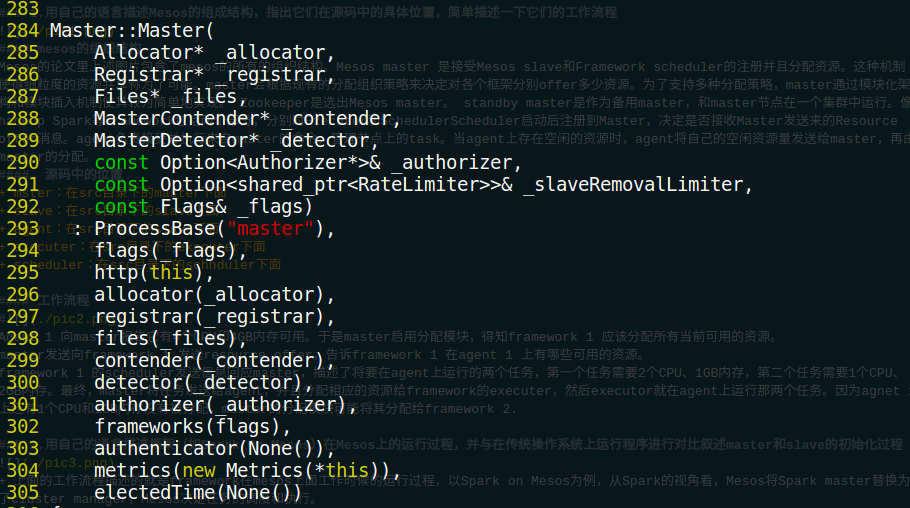
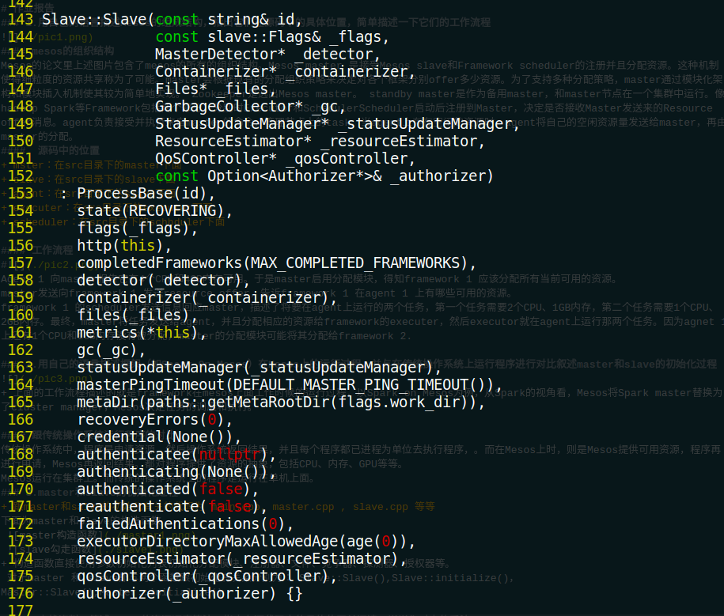
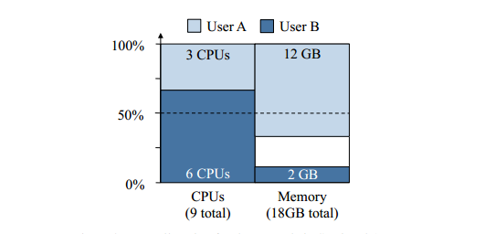
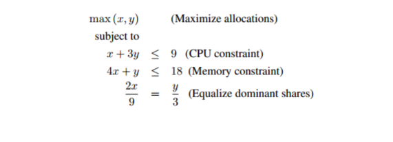

# 作业报告
## 1. 用自己的语言描述Mesos的组成结构，指出它们在源码中的具体位置，简单描述一下它们的工作流程

#### mesos的组织结构
+ Mesos的论文里上述图片包含了mesos的所有的组织结构。Mesos master 是接受Mesos slave和Framework scheduler的注册并且分配资源。这种机制使得细粒度的资源共享称为了可能。master会根据现有的分配组织策略来决定对各个框架分别offer多少资源。为了支持多种分配策略，master通过模块化架构和模块插入机制使其较为简单地实现。 Zookeeper是选出Mesos master。 standby master是作为备用master，和master节点在一个集群中运行。像hadoop Spark等Framework包括两个部分，分别时Executor和SchedulerScheduler启动后注册到Master，决定是否接收Master发送来的Resource offer消息。agent负责接受并执行来自master的命令，管理节点上的task。当agent上存在空闲的资源时，agent将自己的空闲资源量发送给master，再由master的分配。

####  源码中的位置
+ mster：在src目录下的master下面
+ slave：在src目录下的slave下面
+ agent：在src目录下的slave下面
+ executer：在src目录下的executer下面
+ scheduler：在src目录下的schhduler下面

#### 工作流程
#
+ Agent 1 向master报告它有4个CPU和4GB内存可用。于是master启用分配模块，得知framework 1 应该分配所有当前可用的资源。
master发送向framework 1 发送resource offer，告诉framework 1 在agent 1 上有哪些可用的资源。
framework 1 的scheduler发送信息回应master，描述了将要在agent上运行的两个任务，第一个任务需要2个CPU、1GB内存，第二个任务需要1个CPU、2GB内存。最终，master将任务发送给agent，并且分配相应的资源给framework的executer，然后executor就在agent上运行那两个任务。因为agnet 1 上还有1个CPU和1GB内存没有被分配，master的分配模块可能将其分配给framework 2.

## 2. 用自己的语言描述框架（如Spark On Mesos）在Mesos上的运行过程，并与在传统操作系统上运行程序进行对比叙述master和slave的初始化过程

+ 上面的工作流程描述的就是framework在mesos上面工作时候的运行过程，以Spark on Mesos为例，从Spark的视角看，Mesos将Spark master替换为了cluster manager，Mesos决定任务的调度和执行。

#### 跟传统操作系统运行程序的对比 
+ 传统操作系统中，程序是申请资源，然后操作系统返回结果，并且每个程序都已进程为单位去执行程序，。而在Mesos上时，则是Mesos提供可用资源，程序再进行申请，Mesos再返回结果。都对程序提供了资源的抽象，包括CPU、内存、GPU等等。
Mesos运行在集群上。而传统的操作系统上的程序是运行在单机上面。

## 3. master和slave的初始化过程
+ 跟master和salve的初始化有关的代码为 main.cpp, master.cpp , slave.cpp 等等
下面为master和slave的构造函数
 
 
+ 构造函数直接使用参数初始化列表初始化分配模块、注册器、文件、竞争器、探测器、授权器等。
 对于master 和 slave都与两个函数跟初始化有关系分别为： Slave::Slave(),Slave::initialize()，Master::Slave(),Master::initialize()

## 4. 查找资料，简述Mesos的资源调度算法，指出在源代码中的具体位置并阅读，说说你对它的看法

####DRF算法

+ Dominant Resource Fairness，一种针对多种资源类型的分配策略，满足前一章中的所有四种特征。对于所有用户，DRF会计算分配给用户的每一种资源的占用率（share），用户所有占有率中的最大值称作用户的dominant share，与dominant share对应的资源被称作dominant resource。不同的用户有不同的dominant resource。在各个用户的dominant share之间，DRF简单地采用最大最小公平（max-min fairness），设法中最大化系统最小的dominant share，然后是第二小的，以此类推。

+ 一个例子

 考虑一个9CPU、18GBRAM的系统，拥有两个用户，其中用户A运行的任务的需求向量为{1CPU, 4GB}，用户B运行的任务的需求向量为{3CPU，1GB}。在上述方案中，A的每个任务消耗总cpu的1/9和总内存的2/9，所以A的dominant resource是内存；B的每个任务消耗总cpu的1/3和总内存的1/18，所以B的dominant resource为CPU。DRF会均衡用户的dominant shares，如图所示，用户A的任务总共消耗了{3CPU，12GB}，两个用户B的任务总共消耗了{6CPU，2GB}；在这个分配中，每一个用户的dominant share是相等的，用户A获得了2/3的RAM，而用户B获得了2/3的CPU。以上的这个分配可以用如下方式计算出来：x和y分别是用户A和用户B的分配任务的数目，那么用户A消耗了{xCPU，4xGB}，用户B消耗了{3yCPU，yGB}，用户A和用户B消耗了同等dominant resource；用户A的dominant share为4x/18，用户B的dominant share为3y/9。所以DRF分配可以通过求解上面的的优化问题来得到x = 3以及y = 2。因而用户A获得{3CPU，12GB}，B得到{6CPU， 2GB}。

+ 在源码中的位置
DRF算法的源码位于mesos-1.1.0/src/master/allocator/sorter/drf文件夹中，sorter.cpp用来对framework进行排序、add、remove、update等操作。mesos-1.1.0/src/master/allocator/mesos/hierarchical.cpp文件是分层分配器，它调用了sorter.cpp和sorter.hpp进行功能上的具体实现。

## 5. 写一个完成简单工作的框架(语言自选，需要同时实现scheduler和executor)并在Mesos上运行，在报告中对源码进行说明并附上源码，本次作业分数50%在于本项的完成情况、创意与实用程度。（后面的参考资料一定要读，降低大量难度）