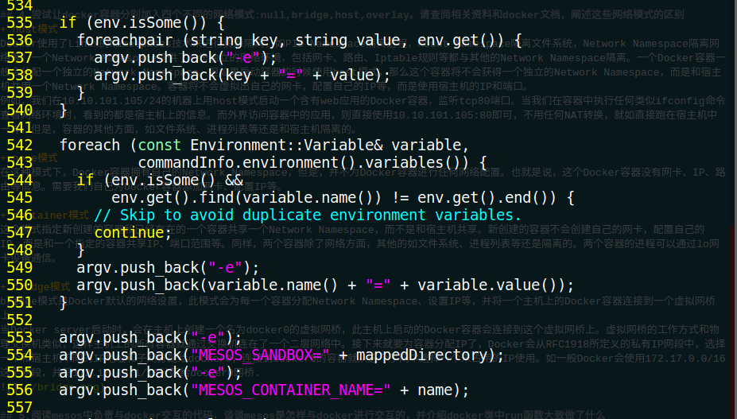

# 作业报告
## 1.安装配置Docker
+ 根据讲义上的教程安装docker

## 2.查阅相关资料及docker相关文档，介绍docker基本命令(如run,images,network等)，要求至少包含镜像管理，容器管理，网络管理三部分的命令，至少介绍5个不同的命令，尽量完整的介绍命令，包括命令的含义和其用法，例子。

###  docker run : 创建一个新的容器并且运行一个命令
+ 语法： docker run [OPTIONS] IMAGE [COMMAND] [ARG...]
+ option 说明
--add-host	 			Add a custom host-to-IP mapping (host:ip)
--attach, -a	 		Attach to STDIN, STDOUT or STDERR    将容器中运行中的进程依附到控制台上
--blkio-weight			Block IO (relative weight), between 10 and 1000, or 0 to disable 
--blkio-weight-device	 Block IO weight (relative device weight)      带宽限制
--cap-add	 			Add Linux capabilities
--cap-drop	 			Drop Linux capabilities
--cgroup-parent	 		Optional parent cgroup for the container
--cidfile	 			Write the container ID to the file
--cpu-count				CPU count (Windows only)
--cpu-percent			CPU percent (Windows only)
--cpu-period			Limit CPU CFS (Completely Fair Scheduler) period
--cpu-quota				Limit CPU CFS (Completely Fair Scheduler) quota
--cpu-rt-period			Limit CPU real-time period in microseconds
--cpu-rt-runtime		Limit CPU real-time runtime in microseconds
--cpu-shares, -c		CPU shares (relative weight)
--cpus					Number of CPUs
--cpuset-cpus	 		CPUs in which to allow execution (0-3, 0,1)
--cpuset-mems	 		MEMs in which to allow execution (0-3, 0,1)
--credentialspec	 	Credential spec for managed service account (Windows only)
--detach, -d			Run container in background and print container ID   	默认后台运行
--detach-keys	 		Override the key sequence for detaching a container
--device	 			Add a host device to the container
--device-read-bps	 	Limit read rate (bytes per second) from a device
--device-read-iops	 	Limit read rate (IO per second) from a device
--device-write-bps	 	Limit write rate (bytes per second) to a device
--device-write-iops	 	Limit write rate (IO per second) to a device
--disable-content-trust		Skip image verification
--dns	 				Set custom DNS servers
--dns-opt	 			Set DNS options
--dns-option	 		Set DNS options
--dns-search	 		Set custom DNS search domains
--entrypoint	 		Overwrite the default ENTRYPOINT of the image
--env, -e	 			Set environment variables
--env-file	 			Read in a file of environment variables
--expose	 			Expose a port or a range of ports
--group-add	 			Add additional groups to join
--health-cmd	 		Command to run to check health
--health-interval		Time between running the check (ns|us|ms|s|m|h) (default 0s)
--health-retries		Consecutive failures needed to report unhealthy
--health-timeout		Maximum time to allow one check to run (ns|us|ms|s|m|h) (default 0s)
--help					Print usage
--hostname, -h	 		Container host name
--init				Run an init inside the container that forwards signals and reaps processes
--init-path	 			Path to the docker-init binary
--interactive, -i		Keep STDIN open even if not attached
--io-maxbandwidth	 	Maximum IO bandwidth limit for the system drive (Windows only)
--io-maxiops			Maximum IOps limit for the system drive (Windows only)
--ip	 				Container IPv4 address (e.g. 172.30.100.104)
--ip6	 				Container IPv6 address (e.g. 2001:db8::33)
--ipc	 				IPC namespace to use
--isolation	 			Container isolation technology
--kernel-memory	 		Kernel memory limit
--label, -l	 			Set meta data on a container
--label-file	 		Read in a line delimited file of labels
--link	 				Add link to another container
--link-local-ip	 		Container IPv4/IPv6 link-local addresses
--log-driver	 		Logging driver for the container
--log-opt	 			Log driver options
--mac-address	 		Container MAC address (e.g. 92:d0:c6:0a:29:33)
--memory, -m	 		Memory limit
--memory-reservation	 Memory soft limit
--memory-swap	 		Swap limit equal to memory plus swap: ‘-1’ to enable unlimited swap
--memory-swappiness	-1		Tune container memory swappiness (0 to 100)
--name	 				Assign a name to the container
--net					default	Connect a container to a network
--net-alias	 			Add network-scoped alias for the container
--network				default	Connect a container to a network
--network-alias	 		Add network-scoped alias for the container
--no-healthcheck		Disable any container-specified HEALTHCHECK
--oom-kill-disable		Disable OOM Killer
--oom-score-adj			Tune host’s OOM preferences (-1000 to 1000)
--pid	 				PID namespace to use
--pids-limit			Tune container pids limit (set -1 for unlimited)
--privileged			Give extended privileges to this container
--publish, -p	 		Publish a container’s port(s) to the host
--publish-all, -P		Publish all exposed ports to random ports
--read-only	false		Mount the container’s root filesystem as read only
--restart				Restart policy to apply when a container exits
--rm					Automatically remove the container when it exits
--runtime	 			Runtime to use for this container
--security-opt	 		Security Options
--shm-size	 			Size of /dev/shm, default value is 64MB
--sig-proxy	true		Proxy received signals to the process
--stop-signal			SIGTERM	Signal to stop a container, SIGTERM by default
--stop-timeout			Timeout (in seconds) to stop a container
--storage-opt	 		Storage driver options for the container
--sysctl				Sysctl options
--tmpfs	 				Mount a tmpfs directory
--tty, -t				Allocate a pseudo-TTY
--ulimit	 			Ulimit options
--user, -u	 			Username or UID (format: <name|uid>[:<group|gid>])
--userns	 			User namespace to use
--uts	 				UTS namespace to use
--volume, -v	 		Bind mount a volume
--volume-driver	 		Optional volume driver for the container
--volumes-from	 		Mount volumes from the specified container(s)
--workdir, -w	 		Working directory inside the container
+ 实例
docker run hello-world

### docker images: 列出本地镜像
+ 语法：docker images [OPTIONS] [REPOSITORY[:TAG]]
+ option 说明
-a :列出本地所有的镜像（含中间映像层，默认情况下，过滤掉中间映像层）；
--digests :显示镜像的摘要信息；
-f :显示满足条件的镜像；
--format :指定返回值的模板文件；
--no-trunc :显示完整的镜像信息；
-q :只显示镜像ID。
+ 实例

### docker pull : 从镜像仓库中拉取或者更新指定镜像
+ 语法: docker pull [OPTIONS] NAME[:TAG|@DIGEST]
+ option　说明
-a :拉取所有 tagged 镜像
--disable-content-trust :忽略镜像的校验,默认开启
+ 实例
docker pull java

### docker start :启动一个或多少已经被停止的容器
### docker stop :停止一个运行中的容器
### docker restart :重启容器
+ 语法
docker start [OPTIONS] CONTAINER [CONTAINER...]
docker stop [OPTIONS] CONTAINER [CONTAINER...]
docker restart [OPTIONS] CONTAINER [CONTAINER...]
+ 实例
docker start myrunoob
docker stop myrunoob
docker restart myrunoob

### docker save : 将指定镜像保存成 tar 归档文件。
+ 语法：docker save [OPTIONS] IMAGE [IMAGE...]
+ option 说明
-o :输出到的文件
+ 实例
docker save -o my_ubuntu.tar ubnutu

### docker network creat: 创建网络
+ 语法：docker network creat [OPTIONS] NETWORK
+ option 说明：
--attachable		Enable manual container attachment
--aux-address		Auxiliary IPv4 or IPv6 addresses used by Network driver
--driver, -d		Driver to manage the Network
--gateway	 		IPv4 or IPv6 Gateway for the master subnet
--internal			Restrict external access to the network
--ip-range	 		Allocate container ip from a sub-range
--ipam-driver		IP Address Management Driver
--ipam-opt		Set IPAM driver specific options
--ipv6			Enable IPv6 networking
--label	 		Set metadata on a network
--opt, -o		Set driver specific options
--subnet	 	Subnet in CIDR format that represents a network segment
+ 实例
docker network create -d overlay \

### docker build: 从指定路径下的Dockerfile 中建立一个镜像
+ 语法：docker build [OPTIONS] PATH | URL | -
+ option 说明：
--build-arg	 				Set build-time variables
--cache-from	 			Images to consider as cache sources
--cgroup-parent	 			Optional parent cgroup for the container
--compress	false			Compress the build context using gzip
--cpu-period				Limit the CPU CFS (Completely Fair Scheduler) period
--cpu-quota					Limit the CPU CFS (Completely Fair Scheduler) quota
--cpu-shares, -c			CPU shares (relative weight)
--cpuset-cpus	 			CPUs in which to allow execution (0-3, 0,1)
--cpuset-mems	 			MEMs in which to allow execution (0-3, 0,1)
--disable-content-trust		Skip image verification
--file, -f	 				Name of the Dockerfile (Default is ‘PATH/Dockerfile’)
--force-rm					Always remove intermediate containers
--isolation	 				Container isolation technology
--label	 					Set metadata for an image
--memory, -m	 			Memory limit
--memory-swap	 			Swap limit equal to memory plus swap: ‘-1’ to enable unlimited swap
--network					Set the networking mode for the RUN instructions during build
--no-cache					Do not use cache when building the image
--pull	false				Always attempt to pull a newer version of the image
--quiet, -q	false			Suppress the build output and print image ID on success
--rm	true				Remove intermediate containers after a successful build
--security-opt	 			Security options
--shm-size	 				Size of /dev/shm, default value is 64MB
--squash					Squash newly built layers into a single new layer
--tag, -t	 				Name and optionally a tag in the ‘name:tag’ format
--ulimit	 				Ulimit options
+ 实例：
docker build .
## 3.创建一个基础镜像为ubuntu的docker镜像，随后再其中加入nginx服务器，之后启动nginx服务器并利用tail命令将访问日志输出到标准输出流。要求该镜像中的web服务器主页显示自己编辑的内容，编辑的内容包含学号和姓名。之后创建一个自己定义的network，模式为bridge，并让自己配的web服务器容器连到这一网络中。要求容器所在宿主机可以访问这个web服务器搭的网站。请在报告中详细阐述搭建的过程和结果。

+ 以可交互的终端模式下运行ubuntu容器的bash命令, 将容器命名为nginx,将容器的80端口映射到宿主机上的2000号端口
  docker run -it - -name  nginx 3000:80 ubuntu bash

+ 加入nginx 并启动
apt-get update
apt-get install -y nginx
nginx

## 4.尝试让docker容器分别加入四个不同的网络模式:null,bridge,host,overlay。请查阅相关资料和docker文档，阐述这些网络模式的区别
+ host模式
Docker使用了Linux的Namespaces技术来进行资源隔离，如PID Namespace隔离进程，Mount Namespace隔离文件系统，Network Namespace隔离网络等。一个Network Namespace提供了一份独立的网络环境，包括网卡、路由、Iptable规则等都与其他的Network Namespace隔离。一个Docker容器一般会分配一个独立的Network Namespace。但如果启动容器的时候使用host模式，那么这个容器将不会获得一个独立的Network Namespace，而是和宿主机共用一个Network Namespace。容器将不会虚拟出自己的网卡，配置自己的IP等，而是使用宿主机的IP和端口。
例如，我们在10.10.101.105/24的机器上用host模式启动一个含有web应用的Docker容器，监听tcp80端口。当我们在容器中执行任何类似ifconfig命令查看网络环境时，看到的都是宿主机上的信息。而外界访问容器中的应用，则直接使用10.10.101.105:80即可，不用任何NAT转换，就如直接跑在宿主机中一样。但是，容器的其他方面，如文件系统、进程列表等还是和宿主机隔离的。

+ none模式
在这种模式下，Docker容器拥有自己的Network Namespace，但是，并不为Docker容器进行任何网络配置。也就是说，这个Docker容器没有网卡、IP、路由等信息。需要我们自己为Docker容器添加网卡、配置IP等。

+ container模式
这个模式指定新创建的容器和已经存在的一个容器共享一个Network Namespace，而不是和宿主机共享。新创建的容器不会创建自己的网卡，配置自己的IP，而是和一个指定的容器共享IP、端口范围等。同样，两个容器除了网络方面，其他的如文件系统、进程列表等还是隔离的。两个容器的进程可以通过lo网卡设备通信。

+ bridge模式
bridge模式是Docker默认的网络设置，此模式会为每一个容器分配Network Namespace、设置IP等，并将一个主机上的Docker容器连接到一个虚拟网桥上。
当Docker server启动时，会在主机上创建一个名为docker0的虚拟网桥，此主机上启动的Docker容器会连接到这个虚拟网桥上。虚拟网桥的工作方式和物理交换机类似，这样主机上的所有容器就通过交换机连在了一个二层网络中。接下来就要为容器分配IP了，Docker会从RFC1918所定义的私有IP网段中，选择一个和宿主机不同的IP地址和子网分配给docker0，连接到docker0的容器就从这个子网中选择一个未占用的IP使用。如一般Docker会使用172.17.0.0/16这个网段，并将172.17.42.1/16分配给docker0网桥.

## 5.阅读mesos中负责与docker交互的代码，谈谈mesos是怎样与docker进行交互的，并介绍docker类中run函数大致做了什么
代码位于mesos-1.1.0/src/docker中
有docker.cpp、docker.hpp、executor.cpp、executor.hpp和spec.cpp五个文件
docker.hpp头文件中定义了Docker类，该类内部又定义了Container和Imagg两个类。docker.cpp文件实现了Docker类中的成员函数，主要负责将参数与docker指令一一对应。比较重要的函数有create,run，stop，kill，rm等等

### run函数大致如下
+ 获取所运行的docker的信息

+ 绑定docker后台的socket和目录

+ 提取运行环境的资源信息

+ 加载环境变量

+ 配置网络模式，支持host，bridge，none 和用户自定义网络

+ 重写镜像的进入点并加载镜像的名称

+ 指定运行目录并运行

## 6.写一个framework