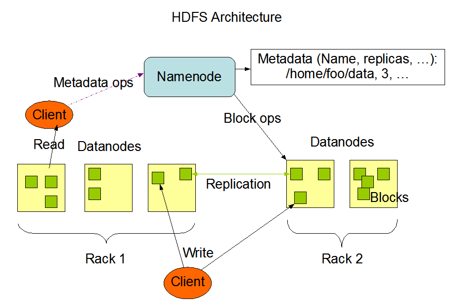
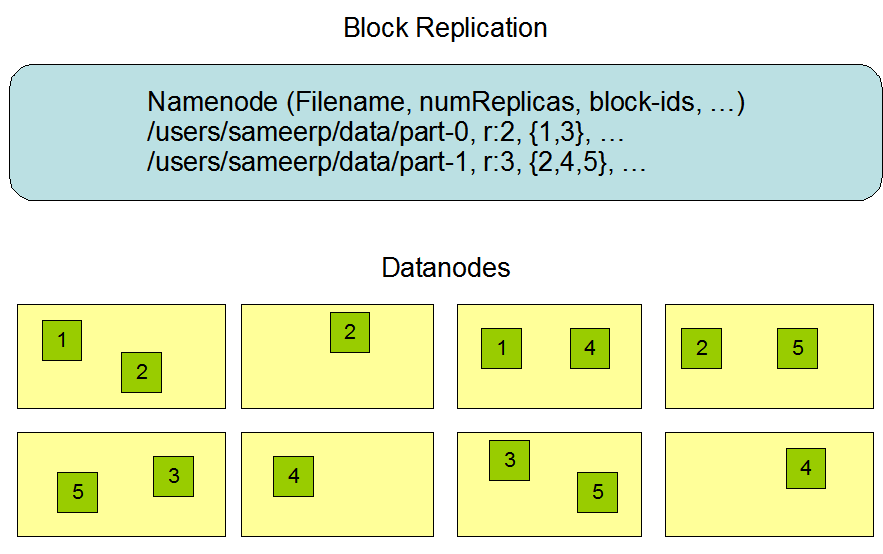
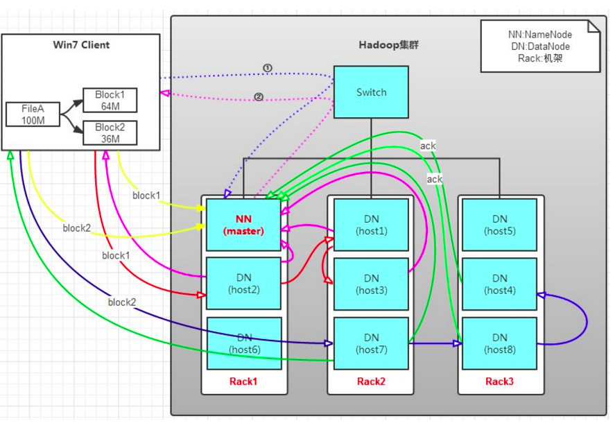
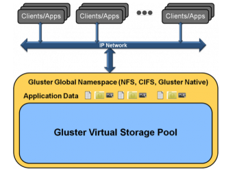
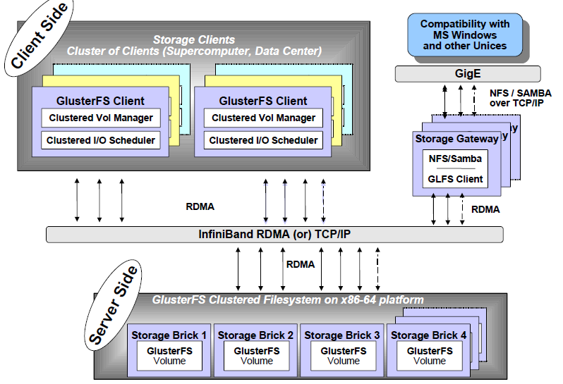
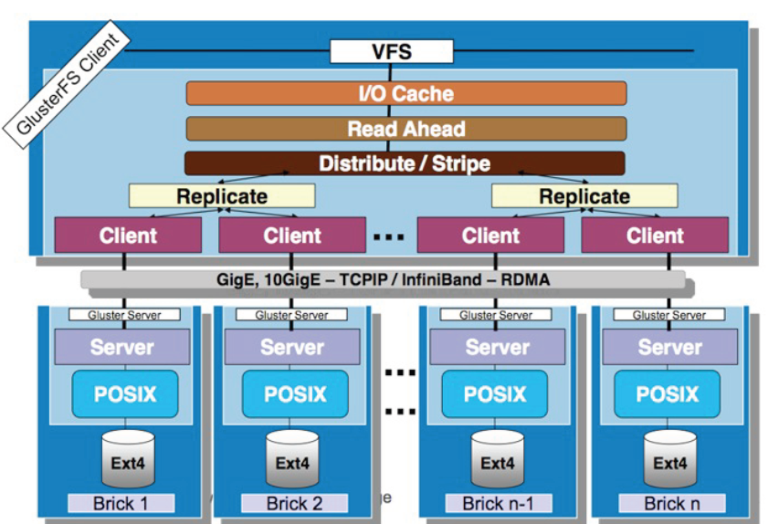
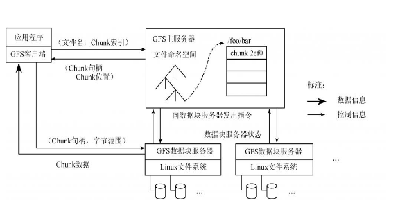

# 作业报告

## 1.调研两种以上的分布式文件系统以及一种联合文件系统，说明其工作原理和特点以及使用方式。
### HDFS
+ 引言
Hadoop分布式文件系统(HDFS)被设计成适合运行在通用硬件(commodity hardware)上的分布式文件系统。它和现有的分布式文件系统有很多共同点。但同时，它和其他的分布式文件系统的区别也是很明显的。HDFS是一个高度容错性的系统，适合部署在廉价的机器上。HDFS能提供高吞吐量的数据访问，非常适合大规模数据集上的应用。HDFS放宽了一部分POSIX约束，来实现流式读取文件系统数据的目的。HDFS在最开始是作为Apache Nutch搜索引擎项目的基础架构而开发的。

+ 硬件错误
硬件错误是常态而不是异常。HDFS可能由成百上千的服务器所构成，每个服务器上存储着文件系统的部分数据。我们面对的现实是构成系统的组件数目是巨大的，而且任一组件都有可能失效，这意味着总是有一部分HDFS的组件是不工作的。因此错误检测和快速、自动的恢复是HDFS最核心的架构目标。

+ 流式数据访问
运行在HDFS上的应用和普通的应用不同，需要流式访问它们的数据集。HDFS的设计中更多的考虑到了数据批处理，而不是用户交互处理。比之数据访问的低延迟问题，更关键的在于数据访问的高吞吐量。POSIX标准设置的很多硬性约束对HDFS应用系统不是必需的。为了提高数据的吞吐量，在一些关键方面对POSIX的语义做了一些修改。

+ 简单的一致性模型
HDFS应用需要一个“一次写入多次读取”的文件访问模型。一个文件经过创建、写入和关闭之后就不需要改变。这一假设简化了数据一致性问题，并且使高吞吐量的数据访问成为可能。Map/Reduce应用或者网络爬虫应用都非常适合这个模型。目前还有计划在将来扩充这个模型，使之支持文件的附加写操作。

+ Namenode 和 Datanode
HDFS采用master/slave架构。一个HDFS集群是由一个Namenode和一定数目的Datanodes组成。Namenode是一个中心服务器，负责管理文件系统的名字空间(namespace)以及客户端对文件的访问。集群中的Datanode一般是一个节点一个，负责管理它所在节点上的存储。HDFS暴露了文件系统的名字空间，用户能够以文件的形式在上面存储数据。从内部看，一个文件其实被分成一个或多个数据块，这些块存储在一组Datanode上。Namenode执行文件系统的名字空间操作，比如打开、关闭、重命名文件或目录。它也负责确定数据块到具体Datanode节点的映射。Datanode负责处理文件系统客户端的读写请求。在Namenode的统一调度下进行数据块的创建、删除和复制。
Namenode和Datanode被设计成可以在普通的商用机器上运行。这些机器一般运行着GNU/Linux操作系统(OS)。HDFS采用Java语言开发，因此任何支持Java的机器都可以部署Namenode或Datanode。由于采用了可移植性极强的Java语言，使得HDFS可以部署到多种类型的机器上。一个典型的部署场景是一台机器上只运行一个Namenode实例，而集群中的其它机器分别运行一个Datanode实例。这种架构并不排斥在一台机器上运行多个Datanode，只不过这样的情况比较少见。
集群中单一Namenode的结构大大简化了系统的架构。Namenode是所有HDFS元数据的仲裁者和管理者，这样，用户数据永远不会流过Namenode。

+ 数据复制
HDFS被设计成能够在一个大集群中跨机器可靠地存储超大文件。它将每个文件存储成一系列的数据块，除了最后一个，所有的数据块都是同样大小的。为了容错，文件的所有数据块都会有副本。每个文件的数据块大小和副本系数都是可配置的。应用程序可以指定某个文件的副本数目。副本系数可以在文件创建的时候指定，也可以在之后改变。HDFS中的文件都是一次性写入的，并且严格要求在任何时候只能有一个写入者。
Namenode全权管理数据块的复制，它周期性地从集群中的每个Datanode接收心跳信号和块状态报告(Blockreport)。接收到心跳信号意味着该Datanode节点工作正常。块状态报告包含了一个该Datanode上所有数据块的列表。

+ 写文件
客户端通过调用这个实例的create方法就可以创建文件。HDFS会发送给NameNode一个远程过程调用，在文件系统的命名空间创建一个新文件，在创建文件前NameNode会做一些检查，如文件是否存在，客户端是否有创建权限等，若检查通过，NameNode会为创建文件写一条记录到本地磁盘的EditLog，若不通过会向客户端抛出IOException。创建成功之后HDFS会返回一个FSDataOutputStream对象，客户端由此开始写入数据。
１．客户端在向NameNode请求之前先写入文件数据到本地文件系统的一个临时文件。
２．待临时文件达到块大小时开始向NameNode请求DataNode信息。
３．NameNode在文件系统中创建文件并返回给客户端一个数据块及其对应DataNode的地址列表（列表中包含副本存放的地址）。
４．客户端只需通过上一步得到的信息把创建的临时文件块更新到列表中的第一个DataNode；第一个DataNode在把数据块写入到磁盘中时会继续向下一个５．DataNode发送信息，以此类推，直到全部完成。
５．当文件关闭，NameNode会提交这次文件创建，此时，文件在文件系统中可见。

+ 删除文件
１．一开始删除文件，NameNode只是重命名被删除的文件到/trash目录，因为重命名操作只是元信息的变动，所以整个过程非常快。在/trash中文件会被保留一定间隔的时间（可配置，默认是6小时），在这期间，文件可以很容易的恢复，恢复只需要将文件从/trash移出即可。
２．当指定的时间到达，NameNode将会把文件从命名空间中删除。
３．标记删除的文件块释放空间，HDFS文件系统显示空间增加。

### GlusterFS
+ 概述
GlusterFS是Scale-Out存储解决方案Gluster的核心，它是一个开源的分布式文件系统，具有强大的横向扩展能力，通过扩展能够支持数PB存储容量和处理数千客户端。GlusterFS借助TCP/IP或InfiniBand RDMA网络将物理分布的存储资源聚集在一起，使用单一全局命名空间来管理数据。GlusterFS基于可堆叠的用户空间设计，可为各种不同的数据负载提供优异的性能。
GlusterFS支持运行在任何标准IP网络上标准应用程序的标准客户端，如图2所示，用户可以在全局统一的命名空间中使用NFS/CIFS等标准协议来访问应用数据。GlusterFS使得用户可摆脱原有的独立、高成本的封闭存储系统，能够利用普通廉价的存储设备来部署可集中管理、横向扩展、虚拟化的存储池，存储容量可扩展至TB/PB级。

+ 扩展性和高性能
GlusterFS利用双重特性来提供几TB至数PB的高扩展存储解决方案。Scale-Out架构允许通过简单地增加资源来提高存储容量和性能，磁盘、计算和I/O资源都可以独立增加，支持10GbE和InfiniBand等高速网络互联。Gluster弹性哈希（Elastic Hash）解除了GlusterFS对元数据服务器的需求，消除了单点故障和性能瓶颈，真正实现了并行化数据访问。

+ 高可用性
GlusterFS可以对文件进行自动复制，如镜像或多次复制，从而确保数据总是可以访问，甚至是在硬件故障的情况下也能正常访问。自我修复功能能够把数据恢复到正确的状态，而且修复是以增量的方式在后台执行，几乎不会产生性能负载。GlusterFS没有设计自己的私有数据文件格式，而是采用操作系统中主流标准的磁盘文件系统（如EXT3、ZFS）来存储文件，因此数据可以使用各种标准工具进

+ 基于标准协议
Gluster存储服务支持NFS, CIFS, HTTP, FTP以及Gluster原生协议，完全与POSIX标准兼容。现有应用程序不需要作任何修改或使用专用API，就可以对Gluster中的数据进行访问。这在公有云环境中部署Gluster时非常有用，Gluster对云服务提供商专用API进行抽象，然后提供标准POSIX接口。
+ 设计目标：弹性存储系统（Elasticity）
存储系统具有弹性能力，意味着企业可以根据业务需要灵活地增加或缩减数据存储以及增删存储池中的资源，而不需要中断系统运行。GlusterFS设计目标之一就是弹性，允许动态增删数据卷、扩展或缩减数据卷、增删存储服务器等，不影响系统正常运行和业务服务。GlusterFS早期版本中弹性不足，部分管理工作需要中断服务，目前最新的3.1.X版本已经弹性十足，能够满足对存储系统弹性要求高的应用需求，尤其是对云存储服务系统而言意义更大。GlusterFS主要通过存储虚拟化技术和逻辑卷管理来实现这一设计目标。

+ 设计目标： 线性横向扩展
线性扩展对于存储系统而言是非常难以实现的，通常系统规模扩展与性能提升之间是LOG对数曲线关系，因为同时会产生相应负载而消耗了部分性能的提升。现在的很多并行/集群/分布式文件系统都具很高的扩展能力，Luster存储节点可以达到1000个以上，客户端数量能够达到25000以上，这个扩展能力是非常强大的，但是Lustre也不是线性扩展的。
纵向扩展（Scale-Up）旨在提高单个节点的存储容量或性能，往往存在理论上或物理上的各种限制，而无法满足存储需求。横向扩展（Scale-Out）通过增加存储节点来提升整个系统的容量或性能，这一扩展机制是目前的存储技术热点，能有效应对容量、性能等存储需求。目前的并行/集群/分布式文件系统大多都具备横向扩展能力。
GlusterFS是线性横向扩展架构，它通过横向扩展存储节点即可以获得线性的存储容量和性能的提升。因此，结合纵向扩展GlusterFS可以获得多维扩展能力，增加每个节点的磁盘可增加存储容量，增加存储节点可以提高性能，从而将更多磁盘、内存、I/O资源聚集成更大容量、更高性能的虚拟存储池。

+ 设计目标： 高可靠性
与GFS（Google File System）类似，GlusterFS可以构建在普通的服务器和存储设备之上，因此可靠性显得尤为关键。GlusterFS从设计之初就将可靠性纳入核心设计，采用了多种技术来实现这一设计目标。首先，它假设故障是正常事件，包括硬件、磁盘、网络故障以及管理员误操作造成的数据损坏等。GlusterFS设计支持自动复制和自动修复功能来保证数据可靠性，不需要管理员的干预。其次，GlusterFS利用了底层EXT3/ZFS等磁盘文件系统的日志功能来提供一定的数据可靠性，而没有自己重新发明轮子。再次，GlusterFS是无元数据服务器设计，不需要元数据的同步或者一致性维护，很大程度上降低了系统复杂性，不仅提高了性能，还大大提高了系统可靠性。

+ 总体架构与设计
GlusterFS总体架构与组成部分如图所示，它主要由存储服务器（Brick Server）、客户端以及NFS/Samba存储网关组成。不难发现，GlusterFS架构中没有元数据服务器组件，这是其最大的设计这点，对于提升整个系统的性能、可靠性和稳定性都有着决定性的意义。GlusterFS支持TCP/IP和InfiniBand RDMA高速网络互联，客户端可通过原生Glusterfs协议访问数据，其他没有运行GlusterFS客户端的终端可通过NFS/CIFS标准协议通过存储网关访问数据。
存储服务器主要提供基本的数据存储功能，最终的文件数据通过统一的调度策略分布在不同的存储服务器上。它们上面运行着Glusterfsd进行，负责处理来自其他组件的数据服务请求。如前所述，数据以原始格式直接存储在服务器的本地文件系统上，如EXT3、EXT4、XFS、ZFS等，运行服务时指定数据存储路径。多个存储服务器可以通过客户端或存储网关上的卷管理器组成集群，如Stripe（RAID0）、Replicate（RAID1）和DHT（分布式Hash）存储集群，也可利用嵌套组合构成更加复杂的集群，如RAID10。
由于没有了元数据服务器，客户端承担了更多的功能，包括数据卷管理、I/O调度、文件定位、数据缓存等功能。客户端上运行Glusterfs进程，它实际是Glusterfsd的符号链接，利用FUSE（File system in User Space）模块将GlusterFS挂载到本地文件系统之上，实现POSIX兼容的方式来访问系统数据。在最新的3.1.X版本中，客户端不再需要独立维护卷配置信息，改成自动从运行在网关上的glusterd弹性卷管理服务进行获取和更新，极大简化了卷管理。GlusterFS客户端负载相对传统分布式文件系统要高，包括CPU占用率和内存占用。
GlusterFS存储网关提供弹性卷管理和NFS/CIFS访问代理功能，其上运行Glusterd和Glusterfs进程，两者都是Glusterfsd符号链接。卷管理器负责逻辑卷的创建、删除、容量扩展与缩减、容量平滑等功能，并负责向客户端提供逻辑卷信息及主动更新通知功能等。GlusterFS 3.1.X实现了逻辑卷的弹性和自动化管理，不需要中断数据服务或上层应用业务。对于Windows客户端或没有安装GlusterFS的客户端，需要通过NFS/CIFS代理网关来访问，这时网关被配置成NFS或Samba服务器。相对原生客户端，网关在性能上要受到NFS/Samba的制约。

GlusterFS是模块化堆栈式的架构设计，如图3所示。模块称为Translator，是GlusterFS提供的一种强大机制，借助这种良好定义的接口可以高效简便地扩展文件系统的功能。服务端与客户端模块接口是兼容的，同一个translator可同时在两边加载。每个translator都是SO动态库，运行时根据配置动态加载。每个模块实现特定基本功能，GlusterFS中所有的功能都是通过translator实现，比如Cluster, Storage, Performance, Protocol, Features等，基本简单的模块可以通过堆栈式的组合来实现复杂的功能。这一设计思想借鉴了GNU/Hurd微内核的虚拟文件系统设计，可以把对外部系统的访问转换成目标系统的适当调用。大部分模块都运行在客户端，比如合成器、I/O调度器和性能优化等，服务端相对简单许多。客户端和存储服务器均有自己的存储栈，构成了一棵Translator功能树，应用了若干模块。模块化和堆栈式的架构设计，极大降低了系统设计复杂性，简化了系统的实现、升级以及系统维护。


## GFS
Google文件系统（Google File System，GFS）是一个大型的分布式文件系统。它为Google云计算提供海量存储，并且与Chubby、MapReduce以及Bigtable等技术结合十分紧密，处于所有核心技术的底层。由于GFS并不是一个开源的系统，我们仅仅能从Google公布的技术文档来获得一点了解，而无法进行深入的研究。
当前主流分布式文件系统有RedHat的GFS[3]（Global File System）、IBM的GPFS[4]、Sun的Lustre[5]等。这些系统通常用于高性能计算或大型数据中心，对硬件设施条件要求较高。以Lustre文件系统为例，它只对元数据管理器MDS提供容错解决方案，而对于具体的数据存储节点OST来说，则依赖其自身来解决容错的问题。例如，Lustre推荐OST节点采用RAID技术或SAN存储区域网来容错，但由于Lustre自身不能提供数据存储的容错，一旦OST发生故障就无法恢复，因此对OST的稳定性就提出了相当高的要求，从而大大增加了存储的成本，而且成本会随着规模的扩大线性增长。
正如李开复所说的那样，创新固然重要，但有用的创新更重要。创新的价值，取决于一项创新在新颖、有用和可行性这三个方面的综合表现。Google GFS的新颖之处并不在于它采用了多么令人惊讶的技术，而在于它采用廉价的商用机器构建分布式文件系统，同时将GFS的设计与Google应用的特点紧密结合，并简化其实现，使之可行，最终达到创意新颖、有用、可行的完美组合。GFS使用廉价的商用机器构建分布式文件系统，将容错的任务交由文件系统来完成，利用软件的方法解决系统可靠性问题，这样可以使得存储的成本成倍下降。由于GFS中服务器数目众多，在GFS中服务器死机是经常发生的事情，甚至都不应当将其视为异常现象，那么如何在频繁的故障中确保数据存储的安全、保证提供不间断的数据存储服务是GFS最核心的问题。GFS的精彩在于它采用了多种方法，从多个角度，使用不同的容错措施来确保整个系统的可靠性。

+ 系统结构
GFS将整个系统的节点分为三类角色：Client（客户端）、Master（主服务器）和Chunk Server（数据块服务器）。Client是GFS提供给应用程序的访问接口，它是一组专用接口，不遵守POSIX规范，以库文件的形式提供。应用程序直接调用这些库函数，并与该库链接在一起。Master是GFS的管理节点，在逻辑上只有一个，它保存系统的元数据，负责整个文件系统的管理，是GFS文件系统中的“大脑”。Chunk Server负责具体的存储工作。数据以文件的形式存储在Chunk Server上，Chunk Server的个数可以有多个，它的数目直接决定了GFS的规模。GFS将文件按照固定大小进行分块，默认是64MB，每一块称为一个Chunk（数据块），每个Chunk都有一个对应的索引号（Index）。

客户端在访问GFS时，首先访问Master节点，获取将要与之进行交互的Chunk Server信息，然后直接访问这些Chunk Server完成数据存取。GFS的这种设计方法实现了控制流和数据流的分离。Client与Master之间只有控制流，而无数据流，这样就极大地降低了Master的负载，使之不成为系统性能的一个瓶颈。Client与Chunk Server之间直接传输数据流，同时由于文件被分成多个Chunk进行分布式存储，Client可以同时访问多个Chunk Server，从而使得整个系统的I/O高度并行，系统整体性能得到提高。

## 安装配置一种分布式文件系统，要求启动容错机制，即一台存储节点挂掉仍然能正常工作。在报告里阐述搭建过程和结果。
+ 安装的分布式系统是GlusterFS
 Step 1 – Have at least two nodes
 Step 2 - Format and mount the bricks
```
 mkfs.xfs -i size=512 /dev/sdb1
    mkdir -p /data/brick1
    echo '/dev/sdb1 /data/brick1 xfs defaults 1 2' >> /etc/fstab
    mount -a && mount
```
Step 3 - Installing GlusterFS
```
 yum install glusterfs-server
```
Step 4 - Configure the trusted pool
```
gluster peer probe server2
gluster peer probe server1
```
Step 5 - Set up a GlusterFS volume
```
mkdir -p /data/brick1/gv0
gluster volume create gv0 replica 2 server1:/data/brick1/gv0 server2:/data/brick1/gv0
gluster volume start gv0
gluster volume info
```
Step 6 - Testing the GlusterFS volume
```
 mount -t glusterfs server1:/gv0 /mnt
      for i in `seq -w 1 100`; do cp -rp /var/log/messages /mnt/copy-test-$i; done
 ls -lA /mnt | wc -l
 ls -lA /data/brick1/gv0
```

