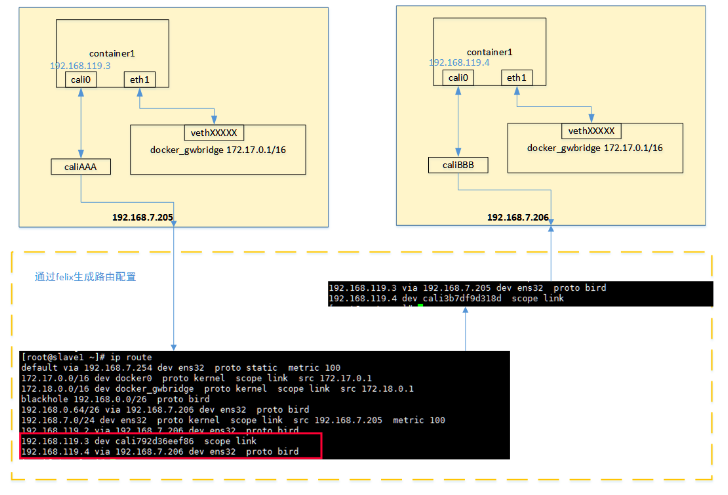

# 作业报告
## 1. 描述Linux内核如何对 IP 数据包进行处理。
Netfilter是Linux操作系统核心层内部的一个数据包处理框架，可以在Linux内核中过滤、修改和封装数据包，Netfilter在IP报文处理流程中插入5个挂载点来，可以在挂载点注册处理数据包的回调函数，当数据包进入Linux内核经过挂载点的时候，会执行回调函数来处理数据包。
Netfilter 更准确地讲是Linux 内核中，一个包过滤框架，默认地，它在这个框架上实现了包过滤、状态检测、网络地址转换和包标记等多种功能，因为它设计的开放性，任何有内核开发经验的开发人员，也可以很容易地利用它提供接口，在内核的数据链路层、网络层，实现自己的功能模块。(比如:实现Ad Hoc的multicasting,如:AODV,就使用了Netfilter)Netfilter的用户空间管理工具，是著名的 iptables 工具套件。
Netfilter框架之所以能实现许多强大的功能，是因为它是内核若干网络转发的关键函数，设计了许多巧妙的钩子函数，比如数据转发，由两个主要函数A 和B函数实现，流程为A->B ，现在改变为A->钩子函数->B，就这么简单，在本章里，就让我们来看看Netfilter框架的设计与实现。

+ NF_IP_PRE_ROUTING　在数据包校验之后路由选择之前

+ NF_IP_LOCAL_IN 　在路由选择之后，数据包的目的是本机

+ NF_IP_FORWARD 目的地是其它主机地数据包

+ NF_IP_LOCAL_OUT　本机数据包其离开本机的过程中

+ NF_IP_POST_ROUTING　在数据包离开本地主机之前

#### 回调函数返回值
注册到挂载点的回调函数，可以获取完整的数据包，对数据包进行操作，回调函数需要一个返回值
```
NF_ACCEPT：继续正常的报文处理；
NF_DROP： 将报文丢弃；
NF_STOLEN：由钩子函数处理了该报文，不要再继续传送；
NF_QUEUE：将报文入队，通常交由用户程序处理；
NF_REPEAT：再次调用该钩子函数。
```
####基本操作
```
在Linux内核中利用Netfilter解析数据包，自适应多层VLan和PPPoe网络环境
对特定DNS域名的请求数据包进行过滤
解析IP层数据头部
对特定端口的数据包进行过滤
解析HTTP请求和返回数据包，对特定Host、URI、文件下载的数据包进行过滤
在以太网环境中，对数据包进行处理
在网桥环境中，对经过网桥的数据包进行解析
```
####在整个Netfilter中，NF_HOOK宏占有重要的作用，它定义在Netfilter.h中：
```
CODE:

#ifdef CONFIG_NETFILTER_DEBUG
#define NF_HOOK(pf, hook, skb, indev, outdev, okfn) 
({int __ret; 
if ((__ret=nf_hook_slow(pf, hook, &(skb), indev, outdev, okfn, INT_MIN)) == 1) 
__ret = (okfn)(skb); 
__ret;}
#define NF_HOOK_THRESH(pf, hook, skb, indev, outdev, okfn, thresh) 
({int __ret; 
if ((__ret=nf_hook_slow(pf, hook, &(skb), indev, outdev, okfn, thresh)) == 1) 
__ret = (okfn)(skb); 
__ret;})
#else
#define NF_HOOK(pf, hook, skb, indev, outdev, okfn) 
({int __ret; 
if (list_empty(&nf_hooks[pf][hook]) || 
(__ret=nf_hook_slow(pf, hook, &(skb), indev, outdev, okfn, INT_MIN)) == 1) 
__ret = (okfn)(skb); 
__ret;})
#define NF_HOOK_THRESH(pf, hook, skb, indev, outdev, okfn, thresh) 
({int __ret; 
if (list_empty(&nf_hooks[pf][hook]) || 
(__ret=nf_hook_slow(pf, hook, &(skb), indev, outdev, okfn, thresh)) == 1) 
__ret = (okfn)(skb); 
__ret;})
#endif
```
#### Filter表及钩子函数的注册
+ 内核在网络堆栈的重要节点，引入了NF_HOOK宏，搭起了整个Netfilter的框架，但是NF_HOOK宏事实上仅是一个转向，更重要的内容是， “内核是如何注册钩子函数以及如何使用它们？”。内核默认的三个表，从框架的角度上来看，这些动作都是一致，我们以filter表为例，来回答这个问题。
要在内核中使用filter表，首先要向内核注册这个表，然后该表在NF_IP_LOCAL_IN、NF_IP_FORWARD、 NF_IP_LOCAL_OUT三个Hook点，注册相应的钩子函数，在内核filter模块的初始化函数（iptable_filter.c），完成了这一功能：

```
CODE:
static int __init init(void)
{
int ret;

if (forward < 0 || forward > NF_MAX_VERDICT) {
printk("iptables forward must be 0 or 1\n");
return -EINVAL;
}


initial_table.entries[1].target.verdict = -forward - 1;


ret = ipt_register_table(&packet_filter, &initial_table.repl);
if (ret < 0)
return ret;


ret = nf_register_hook(&ipt_ops[0]);
if (ret < 0)
goto cleanup_table;

ret = nf_register_hook(&ipt_ops[1]);
if (ret < 0)
goto cleanup_hook0;

ret = nf_register_hook(&ipt_ops[2]);
if (ret < 0)
goto cleanup_hook1;

return ret;

cleanup_hook1:
nf_unregister_hook(&ipt_ops[1]);
cleanup_hook0:
nf_unregister_hook(&ipt_ops[0]);
cleanup_table:
ipt_unregister_table(&packet_filter);

return ret;
}
```

## 2. 在服务器上使用iptables分别实现如下功能并测试：1)拒绝来自某一特定IP地址的访问；2）拒绝来自某一特定mac地址的访问；3）只开放本机的http服务，其余协议与端口均拒绝；4）拒绝回应来自某一特定IP地址的ping命令。

#### 拒绝来自某一特定IP地址的访问
+ 语法规则如下：

```
[root@www ~]# iptables [-AI 链名] [-io 网络接口] [-p 协议] \
> [-s 来源IP/网域] [-d 目标IP/网域] -j [ACCEPT|DROP|REJECT|LOG]
选项与参数：
-AI 链名：针对某的链进行规则的 "插入" 或 "累加"
    -A ：新增加一条规则，该规则增加在原本规则的最后面。例如原本已经有四条规则，
         使用 -A 就可以加上第五条规则！
    -I ：插入一条规则。如果没有指定此规则的顺序，默认是插入变成第一条规则。
         例如原本有四条规则，使用 -I 则该规则变成第一条，而原本四条变成 2~5 号
    链 ：有 INPUT, OUTPUT, FORWARD 等，此链名称又与 -io 有关，请看底下。

-io 网络接口：设定封包进出的接口规范
    -i ：封包所进入的那个网络接口，例如 eth0, lo 等接口。需与 INPUT 链配合；
    -o ：封包所传出的那个网络接口，需与 OUTPUT 链配合；

-p 协定：设定此规则适用于哪种封包格式
   主要的封包格式有： tcp, udp, icmp 及 all 。

-s 来源 IP/网域：设定此规则之封包的来源项目，可指定单纯的 IP 或包括网域，例如：
   IP  ：192.168.0.100
   网域：192.168.0.0/24, 192.168.0.0/255.255.255.0 均可。
   若规范为『不许』时，则加上 ! 即可，例如：
   -s ! 192.168.100.0/24 表示不许 192.168.100.0/24 之封包来源；

-d 目标 IP/网域：同 -s ，只不过这里指的是目标的 IP 或网域。

-j ：后面接动作，主要的动作有接受(ACCEPT)、丢弃(DROP)、拒绝(REJECT)及记录(LOG)
```

+ 在虚拟机上输入命令
```
iptables -A INPUT -s 123.207.164.158 -j REJECT
```
+ 查看INPUT表，发现新增了如下规则:
```
Chain INPUT (policy ACCEPT)
target     prot opt source               destination
REJECT     all  --  123.207.164.158      0.0.0.0/0            reject-with icmp-port-unreachable
```
拒绝访问配置成功

#### 拒绝来自某一特定mac地址的访问
+ 语法规则如下:
```
iptables -A INPUT -m mac --mac-source aa:bb:cc:dd:ee:ff \
> -j ACCEPT
选项与参数：
--mac-source ：来源主机的MAC
```
+ 查看服务器1001机网卡的MAC地址为02:00:0d:4c:00:03，在1000服务器上键入以下命令：
```
iptables -A INPUT -m mac --mac-source 02:00:0d:4c:00:03 -j REJECT
```
+ 查看1000机的iptables，INPUT链中有如下规则：
```
Chain INPUT (policy ACCEPT)
num  target     prot opt source               destination
1    REJECT     all  --  anywhere             anywhere             MAC 02:00:0D:4C:00:03 reject-with icmp-port-unreachable
```
这条规则会拒绝来自网卡MAC地址02:00:0d:4c:00:03的数据包。

#### 只开放本机http服务，其余协议与端口均拒绝
+ 只打开tcp协议的80端口
```
# 允许http服务
iptables -A INPUT -p tcp --dport 80 -j ACCEPT
# 关闭其他服务
iptables -P INPUT DROP
```

+ 远程登录直接超时断开连接，只能通过燕云自带的终端登录。 查看INPUT表，增加了一条规则:
```
Chain INPUT (policy ACCEPT)
target     prot opt source               destination
ACCEPT     tcp  --  0.0.0.0/0            0.0.0.0/0            tcp dpt:80
```
此时在远程通过curl命令可以访问80端口，其余方式均超时,配置成功。

#### 拒绝回应来自某特定IP地址的ping命令
+ 使用如下格式的命令
```
iptables -A INPUT [-p icmp] [--icmp-type 类型] -j ACCEPT
```

## 3. Linux网络设备工作原理
+ 参考：Linux上的基础网络设备详解

### Bridge
Bridge（桥）是 Linux 上用来做 TCP/IP 二层协议交换的设备，与现实世界中的交换机功能相似。Bridge 设备实例可以和 Linux 上其他网络设备实例连接，既 attach 一个从设备，类似于在现实世界中的交换机和一个用户终端之间连接一根网线。当有数据到达时，Bridge 会根据报文中的 MAC 信息进行广播、转发、丢弃处理。

如图所示，Bridge 的功能主要在内核里实现。当一个从设备被 attach 到 Bridge 上时，相当于现实世界里交换机的端口被插入了一根连有终端的网线。这时在内核程序里，netdev_rx_handler_register()被调用，一个用于接受数据的回调函数被注册。以后每当这个从设备收到数据时都会调用这个函数可以把数据转发到 Bridge 上。当 Bridge 接收到此数据时，br_handle_frame()被调用，进行一个和现实世界中的交换机类似的处理过程：判断包的类别（广播/单点），查找内部 MAC 端口映射表，定位目标端口号，将数据转发到目标端口或丢弃，自动更新内部 MAC 端口映射表以自我学习。
　　Bridge 和现实世界中的二层交换机有一个区别，图中左侧画出了这种情况：数据被直接发到 Bridge 上，而不是从一个端口接受。这种情况可以看做 Bridge 自己有一个 MAC 可以主动发送报文，或者说 Bridge 自带了一个隐藏端口和寄主 Linux 系统自动连接，Linux 上的程序可以直接从这个端口向 Bridge 上的其他端口发数据。所以当一个 Bridge 拥有一个网络设备时，如 bridge0 加入了 eth0 时，实际上 bridge0 拥有两个有效 MAC 地址，一个是 bridge0 的，一个是 eth0 的，他们之间可以通讯。由此带来一个有意思的事情是，Bridge 可以设置 IP 地址。通常来说 IP 地址是三层协议的内容，不应该出现在二层设备 Bridge 上。但是 Linux 里 Bridge 是通用网络设备抽象的一种，只要是网络设备就能够设定 IP 地址。当一个 bridge0 拥有 IP 后，Linux 便可以通过路由表或者 IP 表规则在三层定位 bridge0，此时相当于 Linux 拥有了另外一个隐藏的虚拟网卡和 Bridge 的隐藏端口相连，这个网卡就是名为 bridge0 的通用网络设备，IP 可以看成是这个网卡的。当有符合此 IP 的数据到达 bridge0 时，内核协议栈认为收到了一包目标为本机的数据，此时应用程序可以通过 Socket 接收到它。一个更好的对比例子是现实世界中的带路由的交换机设备，它也拥有一个隐藏的 MAC 地址，供设备中的三层协议处理程序和管理程序使用。设备里的三层协议处理程序，对应名为 bridge0 的通用网络设备的三层协议处理程序，即寄主 Linux 系统内核协议栈程序。设备里的管理程序，对应 bridge0 寄主 Linux 系统里的应用程序。
　　Bridge 的实现当前有一个限制：当一个设备被 attach 到 Bridge 上时，那个设备的 IP 会变的无效，Linux 不再使用那个 IP 在三层接受数据。举例如下：如果 eth0 本来的 IP 是 192.168.1.2，此时如果收到一个目标地址是 192.168.1.2 的数据，Linux 的应用程序能通过 Socket 操作接受到它。而当 eth0 被 attach 到一个 bridge0 时，尽管 eth0 的 IP 还在，但应用程序是无法接受到上述数据的。此时应该把 IP 192.168.1.2 赋予 bridge0。
　　另外需要注意的是数据流的方向。对于一个被 attach 到 Bridge 上的设备来说，只有它收到数据时，此包数据才会被转发到 Bridge 上，进而完成查表广播等后续操作。当请求是发送类型时，数据是不会被转发到 Bridge 上的，它会寻找下一个发送出口。用户在配置网络时经常忽略这一点从而造成网络故障。

### VLAN
VLAN 又称虚拟网络，是一个被广泛使用的概念，有些应用程序把自己的内部网络也称为 VLAN。此处主要说的是在物理世界中存在的，需要协议支持的 VLAN。它的种类很多，按照协议原理一般分为：MACVLAN、802.1.q VLAN、802.1.qbg VLAN、802.1.qbh VLAN。其中出现较早，应用广泛并且比较成熟的是 802.1.q VLAN，其基本原理是在二层协议里插入额外的 VLAN 协议数据（称为 802.1.q VLAN Tag)，同时保持和传统二层设备的兼容性。Linux 里的 VLAN 设备是对 802.1.q 协议的一种内部软件实现，模拟现实世界中的 802.1.q 交换机。

如图所示，Linux 里 802.1.q VLAN 设备是以母子关系成对出现的，母设备相当于现实世界中的交换机 TRUNK 口，用于连接上级网络，子设备相当于普通接口用于连接下级网络。当数据在母子设备间传递时，内核将会根据 802.1.q VLAN Tag 进行对应操作。母子设备之间是一对多的关系，一个母设备可以有多个子设备，一个子设备只有一个母设备。当一个子设备有一包数据需要发送时，数据将被加入 VLAN Tag 然后从母设备发送出去。当母设备收到一包数据时，它将会分析其中的 VLAN Tag，如果有对应的子设备存在，则把数据转发到那个子设备上并根据设置移除 VLAN Tag，否则丢弃该数据。
　　在某些设置下，VLAN Tag 可以不被移除以满足某些监听程序的需要，如 DHCP 服务程序。举例说明如下：eth0 作为母设备创建一个 ID 为 100 的子设备 eth0.100。此时如果有程序要求从 eth0.100 发送一包数据，数据将被打上 VLAN 100 的 Tag 从 eth0 发送出去。如果 eth0 收到一包数据，VLAN Tag 是 100，数据将被转发到 eth0.100 上，并根据设置决定是否移除 VLAN Tag。如果 eth0 收到一包包含 VLAN Tag 101 的数据，其将被丢弃。上述过程隐含以下事实：对于寄主 Linux 系统来说，母设备只能用来收数据，子设备只能用来发送数据。和 Bridge 一样，母子设备的数据也是有方向的，子设备收到的数据不会进入母设备，同样母设备上请求发送的数据不会被转到子设备上。可以把 VLAN 母子设备作为一个整体想象为现实世界中的 802.1.q 交换机，下级接口通过子设备连接到寄主 Linux 系统网络里，上级接口同过主设备连接到上级网络，当母设备是物理网卡时上级网络是外界真实网络，当母设备是另外一个 Linux 虚拟网络设备时上级网络仍然是寄主 Linux 系统网络。
　　需要注意的是母子 VLAN 设备拥有相同的 MAC 地址，可以把它当成现实世界中 802.1.q 交换机的 MAC，因此多个 VLAN 设备会共享一个 MAC。当一个母设备拥有多个 VLAN 子设备时，子设备之间是隔离的，不存在 Bridge 那样的交换转发关系，原因如下：802.1.q VLAN 协议的主要目的是从逻辑上隔离子网。现实世界中的 802.1.q 交换机存在多个 VLAN，每个 VLAN 拥有多个端口，同一 VLAN 端口之间可以交换转发，不同 VLAN 端口之间隔离，所以其包含两层功能：交换与隔离。Linux VLAN device 实现的是隔离功能，没有交换功能。一个 VLAN 母设备不可能拥有两个相同 ID 的 VLAN 子设备，因此也就不可能出现数据交换情况。如果想让一个 VLAN 里接多个设备，就需要交换功能。在 Linux 里 Bridge 专门实现交换功能，因此将 VLAN 子设备 attach 到一个 Bridge 上就能完成后续的交换功能。总结起来，Bridge 加 VLAN device 能在功能层面完整模拟现实世界里的 802.1.q 交换机。
　　Linux 支持 VLAN 硬件加速，在安装有特定硬件情况下，图中所述内核处理过程可以被放到物理设备上完成。

### TAP 设备与 VETH 设备
TUN/TAP 设备是一种让用户态程序向内核协议栈注入数据的设备，一个工作在三层，一个工作在二层，使用较多的是 TAP 设备。VETH 设备出现较早，它的作用是反转通讯数据的方向，需要发送的数据会被转换成需要收到的数据重新送入内核网络层进行处理，从而间接的完成数据的注入。

如图所示，当一个 TAP 设备被创建时，在 Linux 设备文件目录下将会生成一个对应 char 设备，用户程序可以像打开普通文件一样打开这个文件进行读写。当执行 write()操作时，数据进入 TAP 设备，此时对于 Linux 网络层来说，相当于 TAP 设备收到了一包数据，请求内核接受它，如同普通的物理网卡从外界收到一包数据一样，不同的是其实数据来自 Linux 上的一个用户程序。Linux 收到此数据后将根据网络配置进行后续处理，从而完成了用户程序向 Linux 内核网络层注入数据的功能。
　　当用户程序执行 read()请求时，相当于向内核查询 TAP 设备上是否有需要被发送出去的数据，有的话取出到用户程序里，完成 TAP 设备的发送数据功能。针对 TAP 设备的一个形象的比喻是：使用 TAP 设备的应用程序相当于另外一台计算机，TAP 设备是本机的一个网卡，他们之间相互连接。应用程序通过 read()/write()操作，和本机网络核心进行通讯。
　　VETH 设备总是成对出现，送到一端请求发送的数据总是从另一端以请求接受的形式出现。该设备不能被用户程序直接操作，但使用起来比较简单。创建并配置正确后，向其一端输入数据，VETH 会改变数据的方向并将其送入内核网络核心，完成数据的注入。在另一端能读到此数据。

## 4.Calico容器网络的收发数据包的过程

### Calico 架构
Calico 是一个三层的数据中心网络方案，而且方便集成 OpenStack 这种 IaaS 云架构，能够提供高效可控的 VM、容器、裸机之间的通信。

结合上面这张图，我们来过一遍 Calico 的核心组件：
+ Felix，Calico agent，跑在每台需要运行 workload 的节点上，主要负责配置路由及 ACLs 等信息来确保 endpoint 的连通状态；
+ etcd，分布式键值存储，主要负责网络元数据一致性，确保 Calico 网络状态的准确性；
+ BGP Client(BIRD), 主要负责把 Felix 写入 kernel 的路由信息分发到当前 Calico 网络，确保 workload 间的通信的有效性；
+ BGP Route Reflector(BIRD), 大规模部署时使用，摒弃所有节点互联的 mesh 模式，通过一个或者多个 BGP Route Reflector 来完成集中式的路由分发.


calico是纯三层的SDN 实现，它基于BPG 协议和Linux自身的路由转发机制，不依赖特殊硬件，容器通信也不依赖iptables NAT或Tunnel 等技术。能够方便的部署在物理服务器、虚拟机（如 OpenStack）或者容器环境下。同时calico自带的基于iptables的ACL管理组件非常灵活，能够满足比较复杂的安全隔离需求。

在主机网络拓扑的组织上，calico的理念与weave类似，都是在主机上启动虚拟机路由器，将每个主机作为路由器使用，组成互联互通的网络拓扑。当安装了calico的主机组成集群后，其拓扑如上图．

通过将整个互联网的可扩展 IP 网络原则压缩到数据中心级别，Calico 在每一个计算节点利用 Linux kernel 实现了一个高效的 vRouter 来负责数据转发 而每个 vRouter 通过 BGP 协议负责把自己上运行的 workload 的路由信息像整个 Calico 网络内传播 － 小规模部署可以直接互联，大规模下可通过指定的 BGP route reflector 来完成。

当容器通过calico进行跨主机通信时，其网络通信模型如下图所示： 


calico为容器生成veth pair，一端作为容器网卡加入到容器的网络命名空间，并设置IP和掩码，一端直接暴露在宿主机上，并通过设置路由规则，将容器IP暴露到宿主机的通信路由上。于此同时，calico为每个主机分配了一段子网作为容器可分配的IP范围，这样就可以根据子网的CIDR为每个主机生成比较固定的路由规则。

当容器需要跨主机通信时，主要经过下面的简单步骤：
+  容器流量通过veth pair到达宿主机的网络命名空间上。
+ 根据容器要访问的IP所在的子网CIDR和主机上的路由规则，找到下一跳要到达的宿主机IP。
+ 流量到达下一跳的宿主机后，根据当前宿主机上的路由规则，直接到达对端容器的veth pair插在宿主机的一端，最终进入容器。

来自或进入workload的IP包都是用workload的宿主的路由表进行路由，用iptables实现防火墙的功能。在Calico中，数据包有可能跨多个节点传输，但是无需对那些中间节点进行配置。对于一个被送到workload的数据包，最后的一跳是从该workload的宿主到workload自身．

## 5. 调研除calico以外的一种容器网络方案，比较其与calico的优缺点
### weave网络通信模型
weave通过在docker集群的每个主机上启动虚拟的路由器，将主机作为路由器，形成互联互通的网络拓扑，在此基础上，实现容器的跨主机通信。其主机网络拓扑参见下图： 

如上图所示，在每一个部署Docker的主机（可能是物理机也可能是虚拟机）上都部署有一个W（即weave router，它本身也可以以一个容器的形式部署）。weave网络是由这些weave routers组成的对等端点（peer）构成，并且可以通过weave命令行定制网络拓扑。

每个部署了weave router的主机之间都会建立TCP和UDP两个连接，保证weave router之间控制面流量和数据面流量的通过。控制面由weave routers之间建立的TCP连接构成，通过它进行握手和拓扑关系信息的交换通信。控制面的通信可以被配置为加密通信。而数据面由weave routers之间建立的UDP连接构成，这些连接大部分都会加密。这些连接都是全双工的，并且可以穿越防火墙。 

当容器通过weave进行跨主机通信时，其网络通信模型可以参考下图：

从上面的网络模型图中可以看出，对每一个weave网络中的容器，weave都会创建一个网桥，并且在网桥和每个容器之间创建一个veth pair，一端作为容器网卡加入到容器的网络命名空间中，并为容器网卡配置ip和相应的掩码，一端连接在网桥上，最终通过宿主机上weave router将流量转发到对端主机上。其基本过程如下：

+ 容器流量通过veth pair到达宿主机上weave router网桥上。
+ weave router在混杂模式下使用pcap在网桥上截获网络数据包，并排除由内核直接通过网桥转发的数据流量，例如本子网内部、本地容器之间的数据以及宿主机和本地容器之间的流量。捕获的包通过UDP转发到所其他主机的weave router端。
+ 在接收端，weave router通过pcap将包注入到网桥上的接口，通过网桥的上的veth pair，将流量分发到容器的网卡上。

weave默认基于UDP承载容器之间的数据包，并且可以完全自定义整个集群的网络拓扑，但从性能和使用角度来看，还是有比较大的缺陷的：
+ weave自定义容器数据包的封包解包方式，不够通用，传输效率比较低，性能上的损失也比较大。
+ 集群配置比较负载，需要通过weave命令行来手工构建网络拓扑，在大规模集群的情况下，加重了管理员的负担。

### calico与weave比较
#### Calico优势
+ 基于iptable/linux kernel包转发效率高，损耗低。
+ 容器间网络三层隔离。
+ 网络拓扑直观易懂，平行式扩展，可扩展性强。

#### Weave优势
+ 支持主机间通信加密。
+ 支持跨主机多子网通信

####Calico劣势
+ Calico仅支持TCP, UDP, ICMP andICMPv6协议。
+ Calico没有加密数据路径。 用不可信网络上的Calico建立覆盖网络是不安全的。
+ 没有IP重叠支持。

####Weave劣势
+ 网络封装是一种传输开销，对网络性能会有影响，不适用于对网络性能要求高的生产场景。

## 6.编写一个mesos framework，使用calico容器网络自动搭建一个docker容器集群（docker容器数量不少于三个），并在其中一个容器中部署jupyter notebook。运行后外部主机可以通过访问宿主机ip+8888端口使用jupyter notebook对docker集群进行管理。
