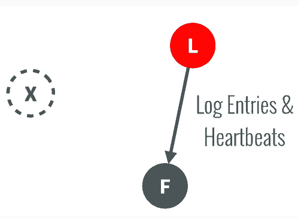

# 作业报告

## 1.阅读Paxos算法的材料并用自己的话简单叙述
###Paxos是什么？
+ Paxos算法是一种基于消息传递通信模型的分布式系统中，使得各节点就某个值达成一致的问题的算法，其既可以工作在单机的多个进程上面，也可以工作在网络上面的多个主机上面。Paxos协议假定各个节点之间的通信采用异步的方式，且基于非拜占庭模型，也就是允许消息的延迟、丢失或者重复，但是不会出现内容损坏、篡改的情况，在实践中通过添加额外的校验信息很容易保证收到的消息是完整的。

在Paxos算法中主要有以下几种角色：Client、Acceptor、Proposer、Learner
+ Client：主要是向分布式系统发送请求，并等待分布式系统的响应，虽然实现的时候也有跟Proposer联系在一起的，但是通常不建议这么做；
+ Acceptor(Voters)：被组织成投标团体，对Proposer提出的决议Prepare/Accept进行表决；
+ Proposer：起到客户代理的作用，请求Acceptor批准客户的请求，同时当发生冲突的时候起着协调者的作用，增加提案号重新请求；
+ Learner：学习已经被Chosen通过的提案，大部分起到replication备份的作用，当客户的请求被批准后，采取相应的行为动作，如果其想要知道某提案是否被通过，比如遗漏了某个命令的决案消息，也可以主动(向Acceptor)发起查询；

###Paxos算法原理
Paxos算法中根据Client的请求，由Proposer发起提案，其中每个提案都有一个全局唯一的数字编号来进行标识，这个编号由外部组件负责生成并且不断地递增，所以在Paxos中每个提案应该是以[提案编号, Value]的组合形式来表示。在Multi-Paxos中每个instance之间是完全独立的，所以不要求这些instance提案编号是相互不同的，而且在一些实现中会同时发送[instance_id, 提案编号, value]的，下文仅考虑一个instance中的Basic-Paxos算法的过程。下面的描述中，对于每个节点，假设[n_a, n_value]是已经被accept的提案编号及其值，n_h表示Acceptor已经遇到并处理过的最大提案编号，n_my表示Proposer当前使用的提案编号：

+  阶段一：Prepare阶段

Proposer选择一个提案编号n_my>n_h，然后向某个多数派Acceptor所组成的集合发送请求，要求该集合中的Acceptor作出回应；
当Acceptor收到这个消息后，如果发现n_my，否则n_h=n，同时返回已经被accept的值，同时该Proposer不会再响应小于n_h(n)的提案了；

+ 阶段二：Accept阶段

如果Proposer没有接收到绝大多数的回应，则延时后重试，采用更大的提案编号；否则
如果Proposer接收到大部分Acceptor的回应，那么查看前面的返回消息，如果之前所有回复的Acceptor都还没有accept任何值(当V=null时)，Proposer可以自己选择任何的V值(当然不会乱选啦，就是原先提案值)，否则V设置为所有中最大n_a对应的n_value，然后返回给所有的节点；
当被发送的Acceptor节点接受到的时候，如果n，否则更新n_a=n, n_value=V, n_h=n，同时返回；

+ 阶段三：Decide阶段(Learner获取提案)

如果Learner从绝大多数Acceptor节点获得，则发送给所有Learner学习；否则
如果Learner没能获得绝大多数Acceptor的，则放弃；
Learner获取一个已经被Chosen选定提案的前提，是这个提案被大多数的Acceptor通过发送所批准。最简单的方式是所有的Acceptor将所有的回复消息发送给所有的Learner，那么通信的数量将会是Acceptor和Leaner数量相乘；优化方法之一是选取一个主Learner，主Leaner得知提案被通过后，再将结果送达给其他Learner，但是这样会引入单点故障的问题；还可以选择一个小范围的Learner集合，这里面的Learner直接接收Acceptor的Chosen消息，然后将结果转达给其他的Learner。当然这里也是假定非拜占庭模型，Learner传播给其他Learner的Chosen Value是可信完整的。
实现上为了可能崩溃或者失效后处理，所有Acceptor在发送响应前必须持久化存储该响应，每一次Paxos结算至少要记录propose、promise、
accept、acknowledgment、commit五类消息，而且为了可靠性必须快速刷新到磁盘上面。

## 2.模拟Raft协议工作的一个场景并叙述处理过程

Paxos和Raft都是为了实现Consensus一致性这个目标，这个过程如同选举一样，参选者需要说服大多数选民(服务器)投票给他，一旦选定后就跟随其操作。Paxos和Raft的区别在于选举的具体过程不同。在Raft中，任何时候一个服务器可以扮演下面角色之一：

+ Leader: 处理所有客户端交互，日志复制等，一般一次只有一个Leader.
+ Follower: 类似选民，完全被动
+ Candidate候选人: 类似Proposer律师，可以被选为一个新的领导人

Raft阶段分为两个，首先是选举过程，然后在选举出来的领导人带领进行正常操作，比如日志复制等。下面用图示展示这个过程：
+ 任何一个服务器都可以成为一个候选者Candidate，它向其他服务器Follower发出要求选举自己的请求

+ 其他服务器同意了，发出OK。

+ 如果在这个过程中，有一个Follower当机，没有收到请求选举的要求，因此候选者可以自己选自己，只要达到N/2 + 1 的大多数票，候选人还是可以成为Leader的。
+ 这样这个候选者就成为了Leader领导人，它可以向选民也就是Follower们发出指令，比如进行日志复制。

+ 以后通过心跳进行日志复制的通知

+ 如果一旦这个Leader当机崩溃了，那么Follower中有一个成为候选者，发出邀票选举。

+ Follower同意后，其成为Leader，继续承担日志复制等指导工作

+ 值得注意的是，整个选举过程是有一个时间限制的，如下图：

Splite Vote是因为如果同时有两个候选人向大家邀票，这时通过类似加时赛来解决，两个候选者在一段timeout比如300ms互相不服气的等待以后，因为双方得到的票数是一样的，一半对一半，那么在300ms以后，再由这两个候选者发出邀票，这时同时的概率大大降低，那么首先发出邀票的的候选者得到了大多数同意，成为领导者Leader，而另外一个候选者后来发出邀票时，那些Follower选民已经投票给第一个候选者，不能再投票给它，它就成为落选者了，最后这个落选者也成为普通Follower一员了。

## 3.Mesos 的容错机制
Mesos的优势之一便是将容错设计到架构之中，并以可扩展的分布式系统的方式来实现。故障处理机制和特定的架构设计实现了Master的容错。

首先，Mesos决定使用热备份（hot-standby）设计来实现Master节点集合。正如Tomas Barton对上图的说明，一个Master节点与多个备用（standby）节点运行在同一集群中，并由开源软件Zookeeper来监控。Zookeeper会监控Master集群中所有的节点，并在Master节点发生故障时管理新Master的选举。建议的节点总数是5个，实际上，生产环境至少需要3个Master节点。 Mesos决定将Master设计为持有软件状态，这意味着当Master节点发生故障时，其状态可以很快地在新选举的Master节点上重建。 Mesos的状态信息实际上驻留在Framework调度器和Slave节点集合之中。当一个新的Master当选后，Zookeeper会通知Framework和选举后的Slave节点集合，以便使其在新的Master上注册。彼时，新的 Master可以根据Framework和Slave节点集合发送过来的信息，重建内部状态。

+ Framework调度器。Framework调度器的容错是通过Framework将调度器注册2份或者更多份到Master来实现。当一个调度器发生故障时，Master会通知另一个调度来接管。需要注意的是Framework自身负责实现调度器之间共享状态的机制。
+ Slave。Mesos实现了Slave的恢复功能，当Slave节点上的进程失败时，可以让执行器/任务继续运行，并为那个Slave进程重新连接那台Slave节点上运行的执行器/任务。当任务执行时，Slave会将任务的监测点元数据存入本地磁盘。如果Slave进程失败，任务会继续运行，当Master重新启动Slave进程后，因为此时没有可以响应的消息，所以重新启动的Slave进程会使用检查点数据来恢复状态，并重新与执行器/任务连接。

